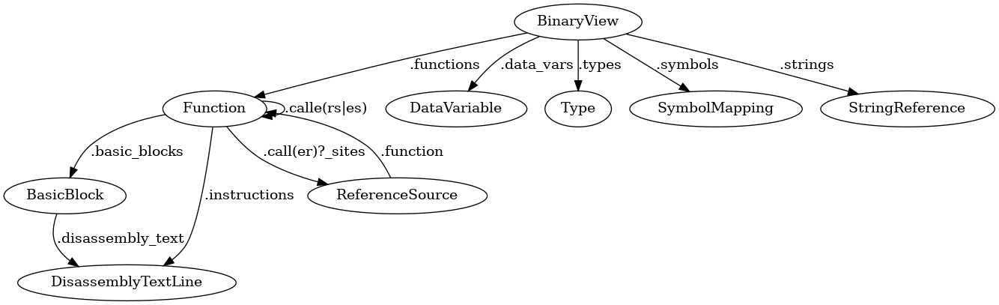
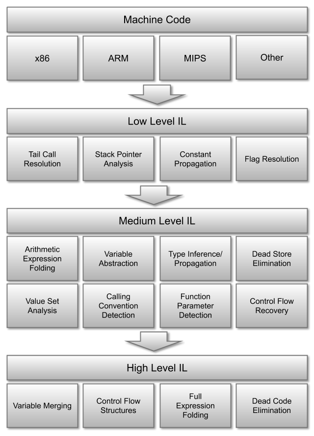
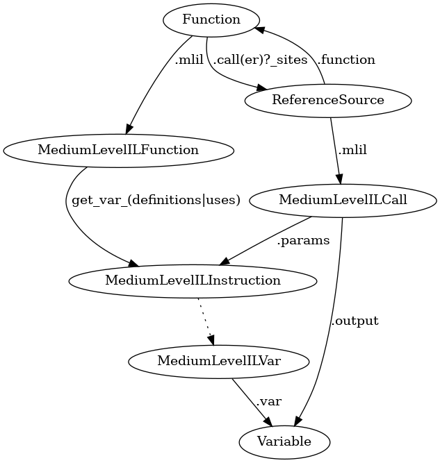
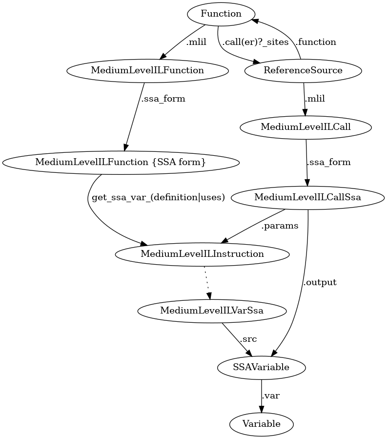
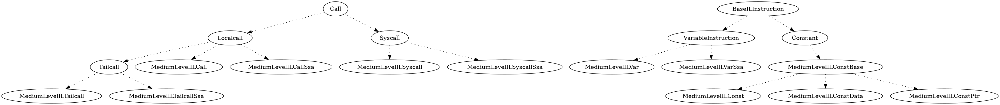

# Binary Ninja API Cheat Sheet

## Overview

## BNIL

### MLIL

- `MediumLevelILVar` is a lifting of `Variable` to `MediumLevelILInstruction`.
- `get_var_definitions(var: Variable)→ List[MediumLevelILInstruction]`
- `get_var_uses(var: Variable)→ List[MediumLevelILInstruction]`

### MLIL SSA

- In static identity assignment, a variable(`Variable`) may be converted into multiple variables(`SSAVariable`).
- `MediumLevelILVarSsa` is a lifting of `SSAVariable` to `MediumLevelILInstruction`.
- `get_ssa_var_definition(ssa_var: SSAVariable | MediumLevelILVarSsa)→ MediumLevelILInstruction | None`
- `get_ssa_var_uses(ssa_var: SSAVariable | MediumLevelILVarSsa)→ List[MediumLevelILInstruction]`

### commonil

## Frequently used functions

- `BinaryView.(define|undefine)_user_(data_var|type)`
- `BinaryView.(create|remove)_user_function`
- `BinaryView.get_function(_at|s_by_name)`
- `BinaryView.get_string_at`
- `BinaryView.(get|set)_comment_at`
- `BinaryView.read`
- `BinaryView.read_(pointer|int)`
- `BinaryView.get_ascii_string_at`
- `(Type|StructureBuilder).builder`
- `Type.(int|array|structure|pointer|function)`
- `Type.named_type_from_registered_type`
- `PointerType.target`
- `Function.(create|delete)_user_var`
- `Function.get_parameter_at`

## Links

- [Binary Ninja Python API](https://api.binary.ninja)
- [Binary Ninja User Documentation: Developer Guide](https://docs.binary.ninja/dev/index.html)
