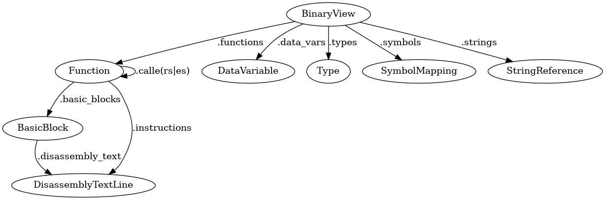
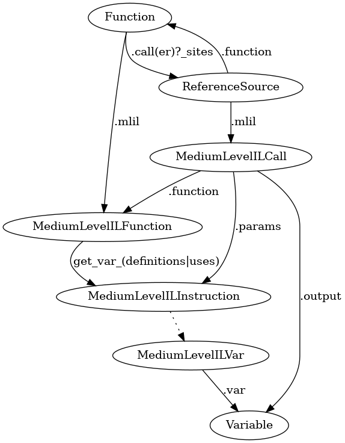
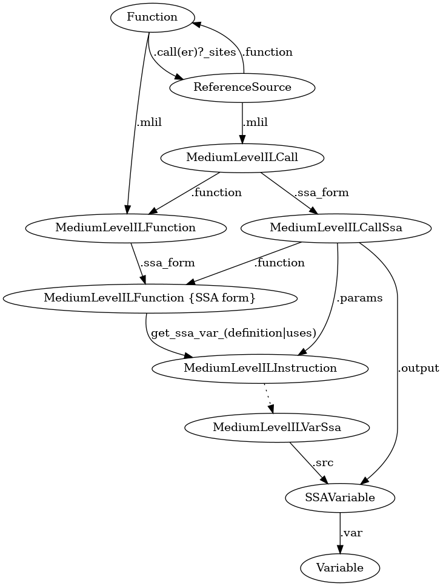

# Binary Ninja API Cheat Sheet

## Overview

## BNIL

### MLIL

- `MediumLevelILVar` is a lifting of `Variable` to `MediumLevelILInstruction`.
- `MediumLevelILFunction.get_var_definitions(var: Variable)→ List[MediumLevelILInstruction]`

### MLIL SSA

- In static identity assignment, a variable(`Variable`) may be converted into multiple variables(`SSAVariable`).
- `MediumLevelILVarSsa` is a lifting of `SSAVariable` to `MediumLevelILInstruction`.
- `MediumLevelILFunction.get_ssa_var_definition(ssa_var: SSAVariable | MediumLevelILVarSsa)→ MediumLevelILInstruction | None`

## Frequently used functions

- `BinaryView.(define|undefine)_user_(data_var|type)`
- `BinaryView.(create|remove)_user_function`
- `BinaryView.get_function(_at|s_by_name)`
- `BinaryView.get_string_at`
- `BinaryView.(get|set)_comment_at`
- `BinaryView.read`
- `BinaryView.read_(pointer|int)`
- `BinaryView.get_ascii_string_at`
- `(Type|StructureBuilder).builder`
- `Type.(int|array|structure|pointer|function)`
- `Type.named_type_from_registered_type`
- `PointerType.target`
- `Function.(create|delete)_user_var`

## memo

    * `BinaryView.define_user_data_var`は既に存在する`data_var`を上書きする
    * `PointerType.target`は、デリファレンスする
    * BinaryView.stringsと型の`char[]`は無関係
        * たとえ文字列を、char以外の肩に変換しても、stringsから削除されない
        * 逆に見つけた文字列に、`char[]`を割り当てても、stringsに追加されない
